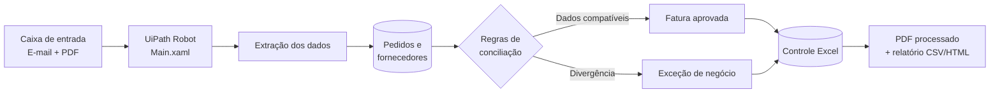

# Automação de Conciliação de Faturas e Pedidos

> RPA desenvolvido em UiPath para receber faturas em PDF, cruzar dados com pedidos de compra e fornecedores, aplicar regras financeiras e registrar o resultado com rastreabilidade.

## Resumo

Este projeto automatiza uma rotina financeira que normalmente exige abertura manual de documentos, consulta de planilhas e conferência de valores. O robô reduz esse processo de aproximadamente **15 minutos para cerca de 2 segundos** no ambiente de demonstração.

Além da automação real em UiPath, o repositório contém um **simulador web interativo** para apresentação do fluxo, dos resultados e da arquitetura técnica.

## Demonstração visual

Na pasta [`dashboard`](dashboard/) há uma interface construída em React que permite:

- selecionar diferentes faturas de teste;
- acompanhar cada etapa do processamento;
- visualizar o pseudocódigo executado;
- conferir o checklist das regras de negócio;
- explorar um mapa técnico dos componentes da solução.

> O dashboard é uma simulação para apresentação. A execução real acontece no UiPath Studio por meio do arquivo [`Main.xaml`](rpa/ConciliaFatura/Main.xaml).

## Fluxo automatizado



O [mapa mental completo](docs/mapa-mental.md) explica os arquivos, entradas, regras e saídas de cada componente.

## O que o robô faz

1. Localiza a fatura em PDF na pasta de entrada.
2. Extrai número da fatura, pedido, CNPJ, fornecedor e valor.
3. Consulta as bases de pedidos e fornecedores.
4. Verifica duplicidade e aplica as regras de negócio.
5. Classifica a fatura como aprovada, divergente ou exceção.
6. Atualiza o controle em Excel e CSV.
7. Move o PDF para a pasta de processados.
8. Gera um relatório consolidado em CSV e HTML.

## Resultados possíveis

| Resultado | Regra aplicada |
|---|---|
| `APROVADA` | Pedido, fornecedor e valor foram conciliados. |
| `FATURA_DUPLICADA` | O número da fatura já existe no controle. |
| `PEDIDO_NAO_ENCONTRADO` | O pedido informado não existe na base. |
| `FORNECEDOR_INVALIDO` | O fornecedor não está apto para aprovação. |
| `DIVERGENCIA_VALOR` | O valor da fatura difere do pedido. |

## Estrutura do repositório

```text
├── rpa/ConciliaFatura/       Projeto UiPath e workflows XAML
├── dashboard/                Simulador visual em React
├── dados/                    Bases e PDFs sintéticos para testes
├── docs/                     Documentação funcional e técnica
├── scripts/                  Geração e validação dos dados
└── tests/                    Testes automatizados das regras
```

## Executar a automação

### UiPath

1. Abra [`rpa/ConciliaFatura/project.json`](rpa/ConciliaFatura/project.json) no UiPath Studio.
2. Copie um PDF de `dados/faturas/exemplos` para `rpa/ConciliaFatura/Data/Entrada`.
3. Execute [`Main.xaml`](rpa/ConciliaFatura/Main.xaml).
4. Consulte o resultado em `dados/resultados/controle_conciliacao.xlsx`.

### Dashboard

```bash
cd dashboard
npm install
npm run dev
```

Acesse `http://localhost:5173` no navegador. Para gerar a versão de produção, execute `npm run build`.

### Publicar no Vercel

[](https://vercel.com/new/clone?repository-url=https%3A%2F%2Fgithub.com%2Fgeovatatsuga%2Fautomacao-conciliacao-faturas-pedidos)

O arquivo [`vercel.json`](vercel.json) já contém os comandos de instalação, build e a pasta de saída. Para publicar:

1. Clique em **Deploy with Vercel** ou importe este repositório no painel do Vercel.
2. Mantenha o diretório raiz do projeto como `./`.
3. Clique em **Deploy**; nenhuma variável de ambiente é necessária.

As próximas alterações enviadas à branch `main` poderão gerar novas versões automaticamente no Vercel.

## Cenários validados

- caminho feliz com aprovação automática;
- fatura duplicada;
- pedido inexistente;
- fornecedor inválido;
- divergência de valor;
- documento corrompido.

Todos os PDFs, fornecedores e pedidos deste projeto são **dados sintéticos**, criados exclusivamente para demonstração.

## Tecnologias

`UiPath Studio` · `XAML` · `Python` · `openpyxl` · `Excel` · `CSV` · `React` · `Vite`

## Documentação

- [Arquitetura](docs/arquitetura.md)
- [Mapa mental técnico](docs/mapa-mental.md)
- [Processo atual — AS IS](docs/processo-as-is.md)
- [Processo automatizado — TO BE](docs/processo-to-be.md)
- [Regras de negócio](docs/regras-de-negocio.md)
- [Estratégia de exceções](docs/estrategia-excecoes.md)
- [Plano de testes](docs/testes.md)

## Licença

Distribuído sob a licença [MIT](LICENSE).
