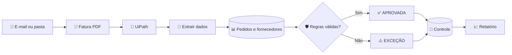
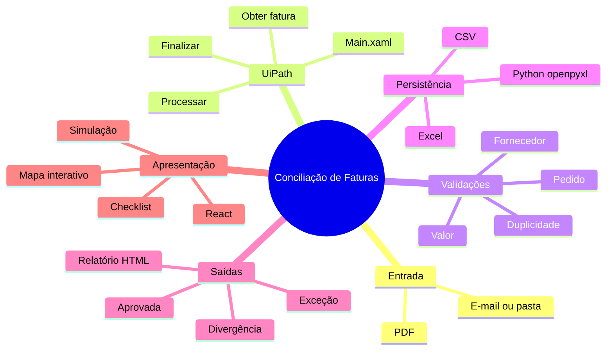

<div align="center">

# 🤖 Automação de Conciliação de Faturas e Pedidos

### RPA financeiro com UiPath, validação de regras e apresentação interativa


[](tests/test_regras.py)
[](LICENSE)
[](https://dashboard-beta-snowy-87.vercel.app/)
[](https://vercel.com/new/clone?repository-url=https%3A%2F%2Fgithub.com%2Fgeovatatsuga%2Fautomacao-conciliacao-faturas-pedidos)

Uma solução demonstrativa que recebe uma fatura em PDF, confere pedido, fornecedor, valor e duplicidade, registra o resultado e gera evidências do processamento.

</div>

---

## Visão geral

O projeto representa uma rotina de **Contas a Pagar** automatizada. O processo manual de abrir documentos, consultar planilhas e comparar valores é executado pelo robô em poucos segundos.

| Entrada | Processamento | Resultado |
|:---:|:---:|:---:|
| 📄 Fatura em PDF | 🤖 UiPath + regras de negócio | ✅ Aprovação ou exceção |
| 📊 Pedidos e fornecedores | 🔎 Consulta e conciliação | 📗 Excel atualizado |
| 📧 Pasta ou e-mail | 🛡️ Validação e duplicidade | 📈 Relatório CSV/HTML |

> **Importante:** o dashboard é uma simulação visual para apresentação. A automação real está nos workflows UiPath, iniciando pelo [`Main.xaml`](rpa/ConciliaFatura/Main.xaml).

## Demonstração interativa

Dashboard publicado: [https://dashboard-beta-snowy-87.vercel.app/](https://dashboard-beta-snowy-87.vercel.app/)

O dashboard permite selecionar diferentes faturas e acompanhar visualmente o robô:

- trilha animada do processamento;
- pseudocódigo de cada atividade;
- comparação entre tempo humano e tempo do robô;
- checklist das validações aprovadas ou reprovadas;
- mapa técnico interativo dos componentes.

```bash
cd dashboard
npm install
npm run dev
```

Depois, acesse `http://localhost:5173`.

<div align="center">

[](https://vercel.com/new/clone?repository-url=https%3A%2F%2Fgithub.com%2Fgeovatatsuga%2Fautomacao-conciliacao-faturas-pedidos)

</div>

## Fluxo da automação



## Regras verificadas

| Verificação | Resultado quando falha |
|---|---|
| O PDF pode ser lido? | Exceção técnica |
| A fatura já foi registrada? | `FATURA_DUPLICADA` |
| O pedido existe? | `PEDIDO_NAO_ENCONTRADO` |
| O fornecedor está válido? | `FORNECEDOR_INVALIDO` |
| Os valores coincidem? | `DIVERGENCIA_VALOR` |
| Todas as regras passaram? | `APROVADA` |

## Componentes principais

| Componente | Tecnologia | Responsabilidade |
|---|---|---|
| [`Main.xaml`](rpa/ConciliaFatura/Main.xaml) | UiPath | Orquestra o processo completo |
| `ObterProximaFatura.xaml` | UiPath | Obtém o próximo PDF da entrada |
| `ProcessarFatura.xaml` | UiPath | Extrai, consulta e valida a fatura |
| `ConsultarPedido.xaml` | UiPath | Pesquisa o pedido na base |
| `atualizar_controle.py` | Python | Atualiza a planilha com openpyxl |
| `dashboard/` | React + Vite | Apresenta a simulação interativa |

## Mapa mental



Veja também o [mapa mental técnico detalhado](docs/mapa-mental.md).

## Estrutura

```text
├── rpa/ConciliaFatura/    # Projeto e workflows UiPath
├── dashboard/             # Simulador visual em React
├── dados/                 # PDFs e planilhas sintéticas
├── docs/                  # Documentação técnica e funcional
├── scripts/               # Geração e validação de dados
└── tests/                 # Testes das regras de negócio
```

## Executar no UiPath

1. Abra [`rpa/ConciliaFatura/project.json`](rpa/ConciliaFatura/project.json) no UiPath Studio.
2. Copie um PDF de `dados/faturas/exemplos` para `rpa/ConciliaFatura/Data/Entrada`.
3. Execute o workflow [`Main.xaml`](rpa/ConciliaFatura/Main.xaml).
4. Consulte o resultado em `dados/resultados/controle_conciliacao.xlsx`.

## Documentação

[Arquitetura](docs/arquitetura.md) · [Processo AS-IS](docs/processo-as-is.md) · [Processo TO-BE](docs/processo-to-be.md) · [Regras de negócio](docs/regras-de-negocio.md) · [Exceções](docs/estrategia-excecoes.md) · [Testes](docs/testes.md)

---

<div align="center">

**Projeto demonstrativo com dados totalmente sintéticos.**

Desenvolvido para estudo e apresentação de automação de processos com UiPath.

</div>
