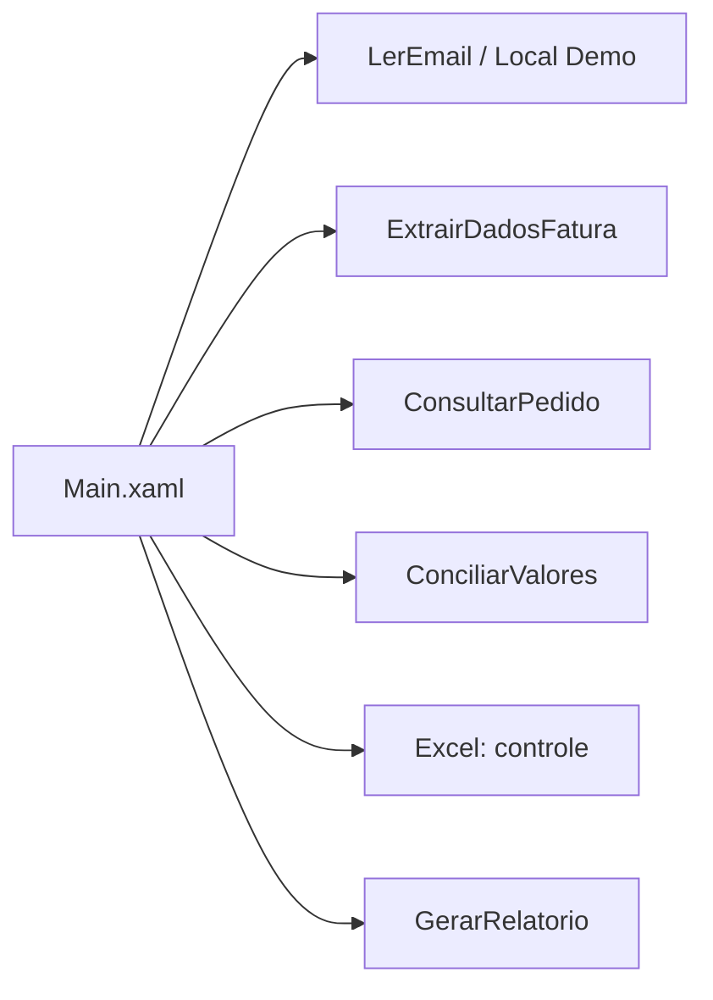

# Arquitetura

O UiPath é o orquestrador. `Main.xaml` encadeia inicialização, obtenção de faturas, processamento e finalização. As bases Excel são acessadas em lote com DataTables; PDF digital é lido e os campos são extraídos com Regex. `LOCAL_DEMO` monitora `Data/Entrada`; `OUTLOOK` exige perfil Outlook Desktop configurado.

