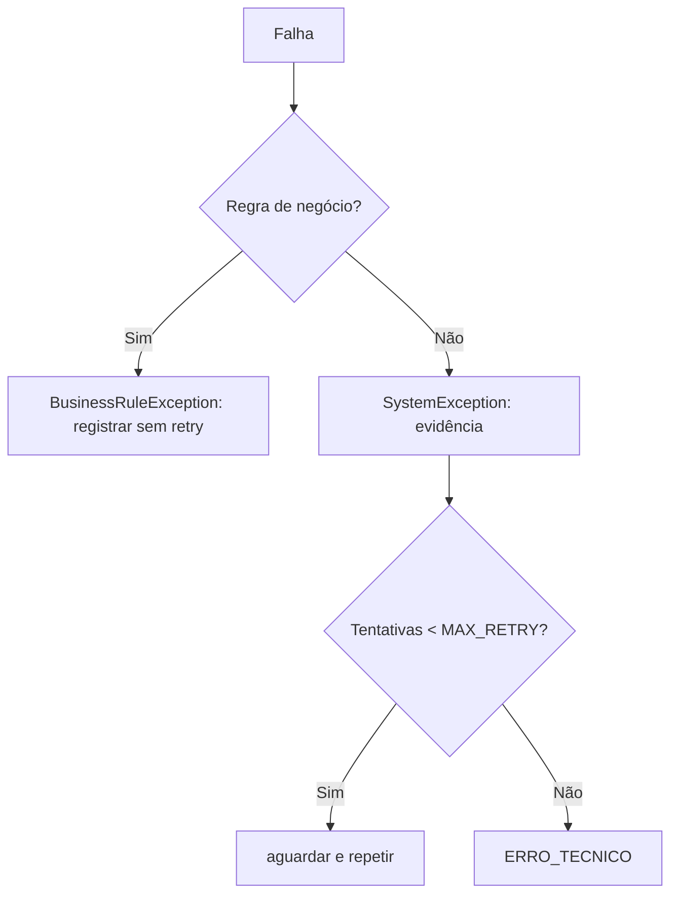

# Estratégia de exceções

`TC010` demonstra o retry somente para bloqueio de Excel. Um PDF ilegível é classificado como exceção de sistema quando a leitura falha; campos ausentes após leitura válida são divergência/revisão.
