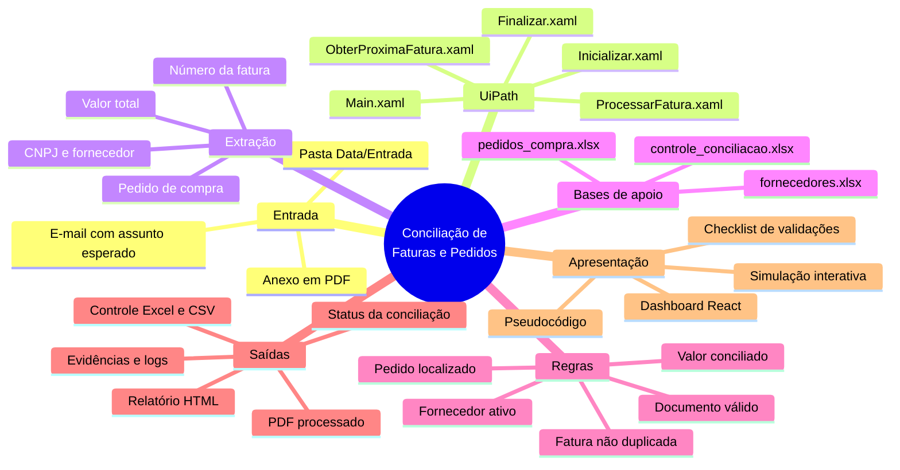
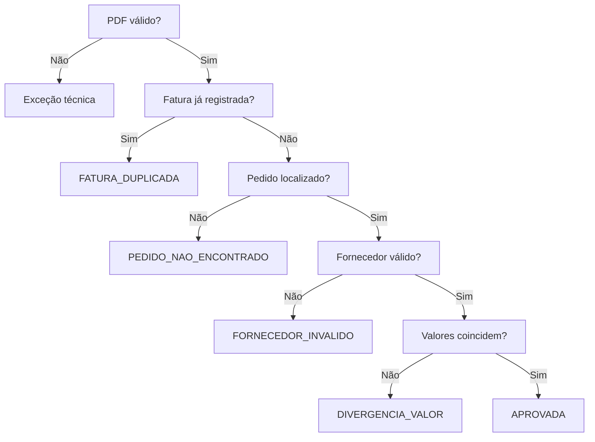

# Mapa mental da automação

Este mapa apresenta como os componentes da **Automação de Conciliação de Faturas e Pedidos** se relacionam.

## Responsabilidade dos componentes

| Componente | Responsabilidade | Entrada | Saída |
|---|---|---|---|
| `Main.xaml` | Orquestrar a execução completa | Configuração e documentos | Fluxo executado |
| `ObterProximaFatura.xaml` | Localizar e salvar o PDF | E-mail ou pasta local | Arquivo de entrada |
| `ProcessarFatura.xaml` | Extrair, consultar e validar | PDF da fatura | Resultado da conciliação |
| `ConsultarPedido.xaml` | Encontrar o pedido correspondente | Identificador do pedido | Registro do pedido |
| `Finalizar.xaml` | Consolidar os indicadores | Controle atualizado | Relatórios CSV e HTML |
| `atualizar_controle.py` | Persistir o resultado no Excel | Dados processados | Planilha atualizada |

## Decisão da conciliação

O mapa interativo equivalente está disponível no dashboard do projeto. Ao selecionar um nó, a interface mostra sua responsabilidade, arquivo associado, entrada, saída e pseudocódigo.
