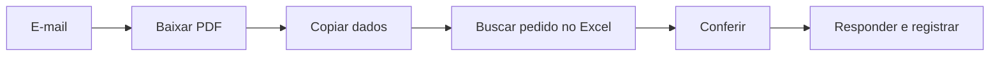

# Processo AS-IS

```mermaid
flowchart LR
E[E-mail]-->D[Baixar PDF]-->X[Copiar dados]-->P[Buscar pedido no Excel]-->C[Conferir]-->R[Responder e registrar]
```

O processo manual repete abertura de e-mail, PDF e planilhas, elevando o risco de divergência e duplicidade.
