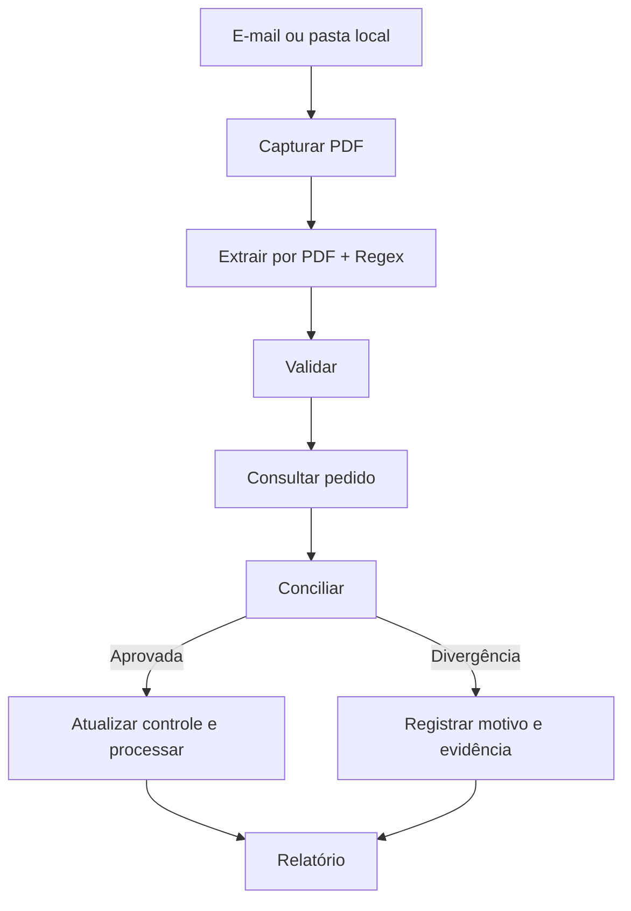

# Processo TO-BE

```mermaid
flowchart TD
E[E-mail ou pasta local]-->A[Capturar PDF]-->X[Extrair por PDF + Regex]-->V[Validar]-->P[Consultar pedido]
P-->C[Conciliar]
C-- Aprovada -->U[Atualizar controle e processar]
C-- Divergência -->D[Registrar motivo e evidência]
U-->R[Relatório]
D-->R
```
